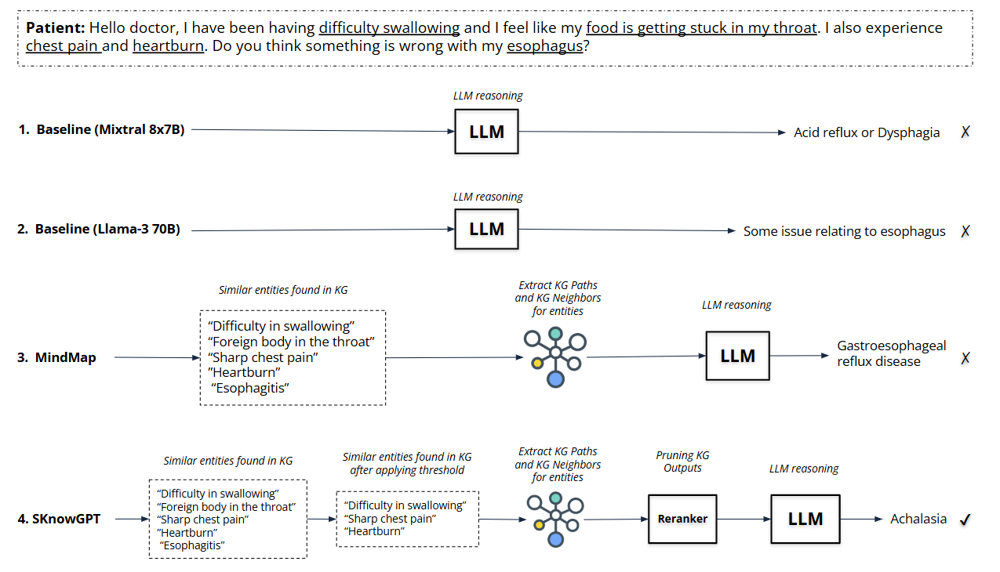

# SKnowGPT: Knowledge Enhanced Question Answering with Similarity Threshold on Domain-Specific Knowledge Graphs

## Overview
we propose a KG-based approach called **SKnowGPT** that extracts context from Knowledge Graphs (KG) based on a similarity threshold between KG entities and question entities. SKnowGPT performs pruning to remove irrelevant context and then uses an LLM to answer the questions. 



## Project Structure

* `data/`: Contains GenMedGPT-5k dataset, DisTreatKG and MedicationQA dataset, MedicationKG.
* `evaluation/`: Contains evaluation scripts for BERTScore evaluation and GPT4 Ranking.
* `figure/`: Contains SKnowGPT approach overview. 
* `output/`: Contains output files.
* `src/`: Contains scripts to run SKnowGPT approach.
* `requirements.txt`: Pip environment file.

## Requirement installation
```
conda create --name sknowgpt python=3.9
conda activate sknowgpt
pip install -r requirements.txt

```
Make sure you have OpenAI API subscription to run any OpenAI models.

## Getting started
Before running SknowGPT for GenMedGPT-5k dataset and using DisTreatKG or MedicationQA dataset with MedicationKG, you need to first build the Knowledge graph (KG) on Neo4j. You need to create a Blank Sandbox on https://sandbox.neo4j.com/ then click on "Connect via drivers" to get your driver and authentication details. Update these details in the `initialise_neo4j()` function in `kg_utils.py` file inside `src/` folder as shown below:

```
uri = "enter_your_uri"
username = "enter_your_username"     
password = "enter_your_password"
```
Note, loading the DisTreatKG for the first time could take approximately 20 mins to 1 hour depending on your internet connection.

## Running the experiments:

Navigate to the `src/` folder and then run below command:
```
python main.py \
--read_dataset <Enter_dataset_name> \ # Enter dataset name you want to run SKnowGPT one: GenMedGPT or MedicationQA
--mode thresold \ # Select mode of experiment - with similarity threshold (default for SKnowGPT) or with no threshold: threshold, no_threshold
--LLM_model gpt-3.5-turbo \ # Select one LLM model from: gpt-3.5-turbo, llama3, mixtral
--openai_api_keys <Enter_OPENAI_API_KEY> \ # Enter OpenAI API key 
--max_length 256 \ # Max length of LLM output
--temperature 0.1 \ # Temperature used in LLM
--output_file output_file.csv \ # Enter output file name if required
--start_idx 0 \ # Start index from where to begin answering questions from the dataset
--rerank_model cohere \ # Select Reranker model : medcpt, cohere
--cohere_api_keys <Enter_Cohere_API_KEY> \ # Enter Cohere API key
--top_n 10 \ #Top n paths to keek after Reranking
```

Example: To run the script for GenMedGPT-5k dataset
```
python main.py --read_dataset GenMedGPT --LLM_model llama3 --output_file SKnowGPT_GenMedGPT_output_l3.csv --rerank_model cohere --cohere_api_keys <Enter_Cohere_API_KEY>
```

Example: To run the script for MedicationQA dataset
```
python main.py --read_dataset MedicationQA --LLM_model llama3 --output_file SKnowGPT_MedQA_output_l3.csv --rerank_model cohere --cohere_api_keys <Enter_Cohere_API_KEY>
```

## Evaluation
### BERTScore Evaluation
To evaluate your output using BERTScore, navigate to `evaluation` folder and run the `BERTScore.ipynb` file. Update the name of the input file and name of the output file. The output file will be saved under `evaluation/BERTScore_results`.

### GPT4 Ranking Evaluation
To evaluate your output using GPT4 Ranking, navigate to `evaluation` folder and open the `GPT_4_ranking.ipynb` file. Update the name of the input file and name of the output file. The output file will be saved under `evaluation/GPT4_Ranking_results`. Note, you will need an OpenAI API key to run the GPT4 ranking.
