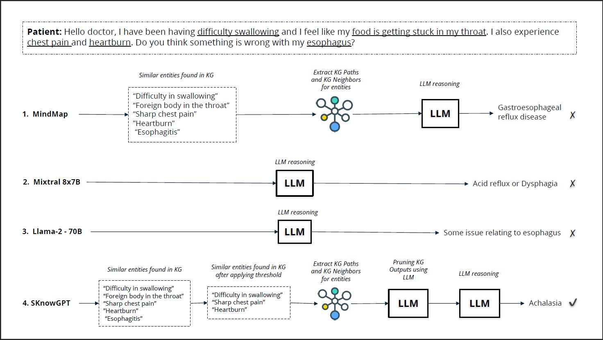

# SKnowGPT: Enhanced LLM-based Question Answering using Domain-Specific Knowledge Graphs

## Overview
We propose a KG-based approach called **SKnowGPT** that performs double pruning to remove irrelevant context from the extracted knowledge of a domian specific knowldge graph to answer questions using an LLM. Below is an illustration of the SKnowGPT approach using an example.



## Project Structure

- `data/`: Contains curated and complete GenMedGPT-5k dataset, DisTreatKG and EMCKG.
- `evaluation/`: Contains evaluation scripts for BERTScore evaluation and GPT4 Ranking.
- `figure/`: Contains SKnowGPT approach overview. 
- `output/`: Contains output files.
- `pre-processing/`: Contains pre-processing script.
- `Baseline_llama2.py`: Script to run baseline Llama2 70B experiment.
- `Baseline_llama3.py`: Script to run baseline Llama3 70B experiment.
- `Baseline_mixtral.py`: Script to run baseline Mixtral 8x7B experiment.
- `SKnowGPT_gpt3.py`: Script to run SKnowGPT approach with GPT3.5 model.
- `SKnowGPT_llama2.py`: Script to run SKnowGPT approach with Llama2 70B model.
- `SKnowGPT_mixtral.py`: Script to run SKnowGPT approach with Mixtral 8x7B model.
- `requirements.txt`: Pip environment file for running SKnowGPT and baseline approaches for Mixtral and Llama2 models.
- `gpt3_llama3_requirements.txt`: Pip environment file for running SKnowGPT and baseline approaches for GPT 3.5 and Llama3 models.

## How to Run
To run SknowGPT using GenMedGPT-5k dataset and using DisTreatKG, you need to first build the Knowledge graph (KG) on Neo4j. You need to create a Blank Sandbox on https://sandbox.neo4j.com/ then click on "Connect via drivers" to get your driver and authentication details. Update these details in the SKnowGPT code as shown below:

```
uri = "enter_your_uri"
username = "enter_your_username"     
password = "enter_your_password"
```
Note, loading the DisTreatKG for the first time could take approximately 30 mins to 1 hour depending on your internet connection.

## Evaluation
### BERTScore Evaluation
To evaluate your output using BERTScore, navigate to evaluation and open the `BertScore.ipynb` file. Update the name of the input file and name of the output file. The output file will be saved under `evaluation/BERTScore_results`.

### GPT4 Ranking Evaluation
To evaluate your output using GPT4 Ranking, navigate to evaluation and open the `GPT_4_ranking.ipynb` file. Update the name of the input file and name of the output file. The output file will be saved under `evaluation/GPT4_Ranking_results`. Note, you will need an OpenAI API key to run the GPT4 ranking.
